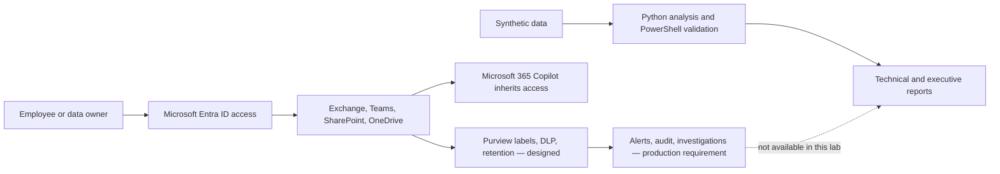

# Microsoft Purview Healthcare Data Security & AI Governance Lab

> A recruiter-ready hybrid lab demonstrating local security automation, Microsoft Purview policy engineering, healthcare DLP test design, simulated forensic investigation, and Microsoft 365 Copilot readiness.

[](#evidence-model) [](#honest-limitations) [](automation/validation-results.md)

## Executive overview

Contoso Care Assist is a fictional healthcare-technology company preparing for Microsoft 365 Copilot. This project defines how it would classify patient-linked information, protect external sharing, investigate potential exposure, govern retention, review inherited access, and report risk.

The lab produced working local automation against 14 synthetic test cases, including strong positives, boundary cases, false-positive candidates, and negative controls. It also produced deployable Purview specifications and a clearly fictional investigation. No Microsoft 365 tenant was available, so no tenant configuration or telemetry is claimed.

## Demonstrated results

| Result | Evidence | Boundary |
|---|---|---|
| 14 synthetic cases analyzed | **IMPLEMENTED LOCALLY** | Demonstration detector, not Purview classification |
| 7 Python unit tests passed | **IMPLEMENTED LOCALLY** | Validates local logic only |
| 12 PowerShell configuration checks passed, 0 failed | **IMPLEMENTED LOCALLY** | Sanitized sample export, not a tenant export |
| Four-level taxonomy and PHI-only encryption design | **DESIGNED FOR PURVIEW** | Not published or enforced |
| SharePoint/OneDrive external-sharing DLP policy and 12-case matrix | **DESIGNED FOR PURVIEW** | Not run in Purview simulation mode |
| External PHI-sharing forensic workflow | **SIMULATED INVESTIGATION** | No real user, event, alert, or exposure |
| Copilot access-review gate and AI governance plan | **DESIGNED FOR PURVIEW** | No Copilot or DSPM telemetry |

## Evidence model

- **IMPLEMENTED LOCALLY** — code or workflows personally executed and validated using synthetic data or sanitized configuration samples.
- **DESIGNED FOR PURVIEW** — technically detailed Microsoft Purview configuration that was not deployed.
- **SIMULATED INVESTIGATION** — fictional evidence and events used to demonstrate analyst reasoning.

Every major artifact states its evidence boundary. A design is never presented as deployment evidence.

## Architecture and data flow



See the full [architecture overview](architecture/architecture-overview.md) and [Mermaid source](architecture/purview-data-security-workflow.mmd).

## Security design

### Classification and information protection

The [classification taxonomy](policies/classification-taxonomy.md) defines Public, Internal, Confidential, and Highly Confidential – PHI. The [sensitivity-label design](policies/sensitivity-label-design.md) encrypts only the PHI label initially, while the [publishing plan](policies/label-publishing-plan.md) uses a small role-diverse pilot.

### Data Loss Prevention

The [Healthcare Sensitive Data External Sharing Policy](policies/dlp-policy-design.md) starts in simulation, covers SharePoint and OneDrive, and progresses to block with business-justified override only after tuning. Its [test matrix](policies/dlp-test-matrix.md) separates a technical match from context, risk, exposure, and final analyst disposition.

### Investigation and response

The [investigation playbook](investigations/investigation-playbook.md) requires evidence of access or sharing before declaring exposure. The [fictional case](investigations/external-phi-sharing-case.md) demonstrates intake, scope, evidence preservation, severity, containment, root cause, and remediation without inventing tenant telemetry.

### Lifecycle and AI readiness

The [lifecycle plan](policies/data-lifecycle-plan.md) distinguishes retention, deletion, legal hold, and disposition review. The [AI governance plan](policies/ai-data-governance-plan.md) gates Copilot pilot access on owner-approved permission reviews because Copilot can surface content a user can already access; it does not repair oversharing.

## Local automation

The [automation guide](automation/README.md) documents execution, error handling, sanitization, and future guarded read-only use.

```powershell
python .\automation\Analyze-SensitiveData.py --sharing-state external
python -m unittest discover -s .\automation\tests -v
powershell -NoProfile -ExecutionPolicy Bypass -File .\automation\Export-PurviewConfiguration.ps1 -Mode Sample
powershell -NoProfile -ExecutionPolicy Bypass -File .\automation\Test-PurviewConfiguration.ps1
```

Validated outputs are recorded in [validation-results.md](automation/validation-results.md). Generated reports are intentionally ignored by Git.

## Evidence gallery

All displayed records are synthetic and use reserved `example.test` addresses.

| Case coverage | Safety validation |
|---|---|
|  |  |

| Python analysis | PowerShell configuration validation |
|---|---|
|  |  |

The [evidence register and final capture checklist](screenshots/README.md) states what each image proves and what remains missing.

## Reporting and governance

- [Executive summary](reporting/executive-summary.md)
- [Technical findings](reporting/technical-findings.md)
- [Prioritized remediation playbook](reporting/remediation-playbook.md)
- [30/60/90-day roadmap](reporting/30-60-90-day-roadmap.md)
- [Illustrative NIST/ISO mapping](compliance/nist-iso-control-mapping.md)
- [Decision log](DECISION_LOG.md)

The executive priority is to review access to patient-data repositories before a Copilot pilot. This is a design risk requiring validation—not a claim that inappropriate access was observed.

## Key decisions

- Use a free hybrid implementation because no authorized tenant was available.
- Prioritize PHI classification and SharePoint/OneDrive DLP.
- Treat confirmed identity + MRN + clinical context as High in the local detector; route incomplete combinations to review.
- Encrypt Highly Confidential – PHI only during the first label pilot.
- Start DLP in simulation and progress to block with justified override after tuning.
- Require evidence of actual access or sharing before confirming exposure.
- Retain raw AI-evaluation data for 90 days subject to organizational approval.
- Require owner-approved permission reviews before Copilot pilot access.
- Use evidence-level NIST/ISO mapping without compliance or maturity claims.

## Honest limitations

- No authorized Microsoft 365 tenant, Purview portal, E5 sandbox, or Copilot environment was used.
- No label, DLP policy, retention control, alert, audit search, eDiscovery case, Insider Risk case, Communication Compliance case, or DSPM assessment was deployed or observed.
- Local regex and context logic are not a replacement for Microsoft Purview sensitive information types, trainable classifiers, or production telemetry.
- The forensic case is fictional, and the NIST/ISO crosswalk is illustrative.
- Production implementation requires licensing, least-privileged roles, change control, legal/privacy/records approval, pilot testing, and operating-effectiveness evidence.

See [honest limitations](interview/honest-limitations.md) for the complete interview response.

## What I learned

- Detection is not the same as classification, risk, exposure, or incident severity.
- Boundary and negative-control cases are essential for precision and operational usability.
- Creating a label does not make it available; publishing and scoped testing are separate steps.
- Container labels control container behavior but do not automatically label every stored file.
- DLP enforcement should be evidence-gated and tuned before broad blocking.
- Copilot readiness is fundamentally an identity, permissions, data-governance, and monitoring problem.
- Execution evidence is stronger than untested code: local testing found and corrected Python loading and Windows PowerShell 5.1 compatibility defects.

## Future improvements

With an authorized tenant, the next steps are a five-user pilot, repository-owner access reviews, Purview label publication, DLP simulation, sanitized evidence collection, audit/eDiscovery validation, and controlled Copilot readiness testing. Production findings would replace—not be blended with—the simulated artifacts.

## Interview preparation

- [30-second, 2-minute, 5-minute, and 10-minute walkthroughs](interview/project-walkthrough.md)
- [Technical interview questions and answers](interview/technical-questions.md)
- [Honest limitations and production-experience positioning](interview/honest-limitations.md)

## Authoritative references

- [Official SC-401 lab instructions](https://microsoftlearning.github.io/SC-401T00-Information-Security-Administrator/)
- [Microsoft Purview documentation](https://learn.microsoft.com/en-us/purview/)
- [Learn about sensitivity labels](https://learn.microsoft.com/en-us/purview/sensitivity-labels)
- [Learn about data loss prevention](https://learn.microsoft.com/en-us/purview/dlp-learn-about-dlp)
- [Learn about retention](https://learn.microsoft.com/en-us/purview/retention)
- [Microsoft Purview eDiscovery](https://learn.microsoft.com/en-us/purview/ediscovery/)
- [Data Security Posture Management for AI](https://learn.microsoft.com/en-us/purview/ai-microsoft-purview)
- [Data, privacy, and security for Microsoft 365 Copilot](https://learn.microsoft.com/en-us/copilot/microsoft-365/microsoft-365-copilot-privacy)

## Repository status

Phases 0 through 12 are complete. See [STATUS.md](STATUS.md) for the evidence and capability boundaries.
