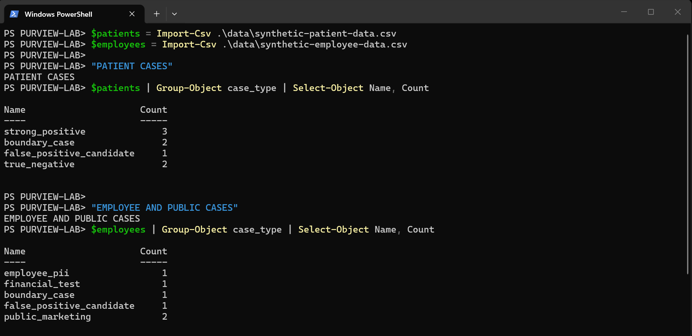
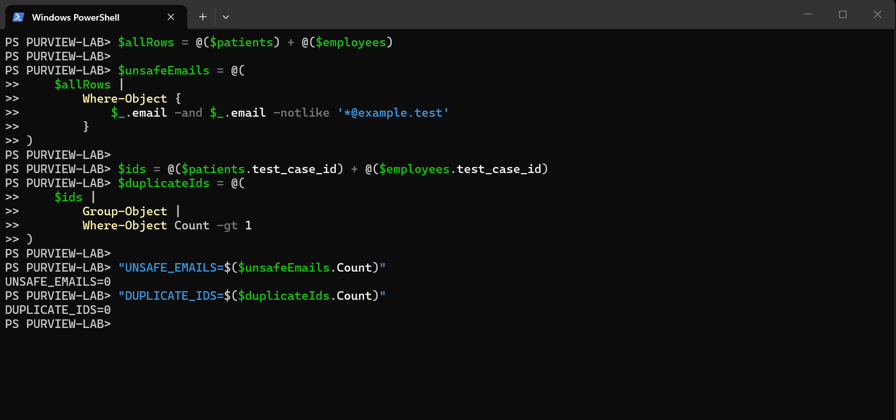
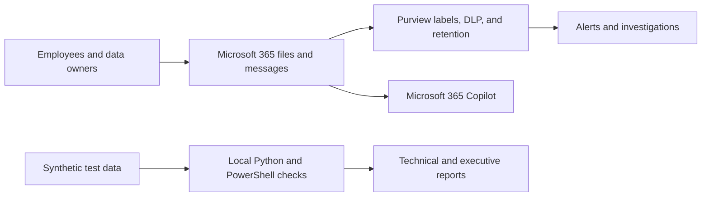
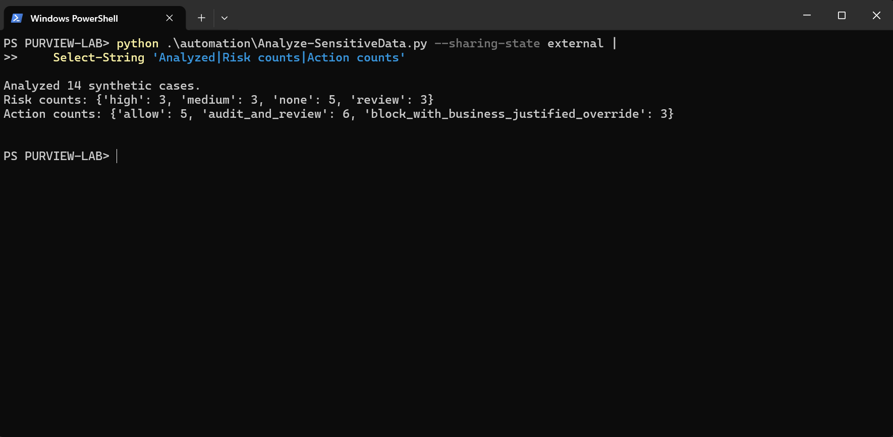
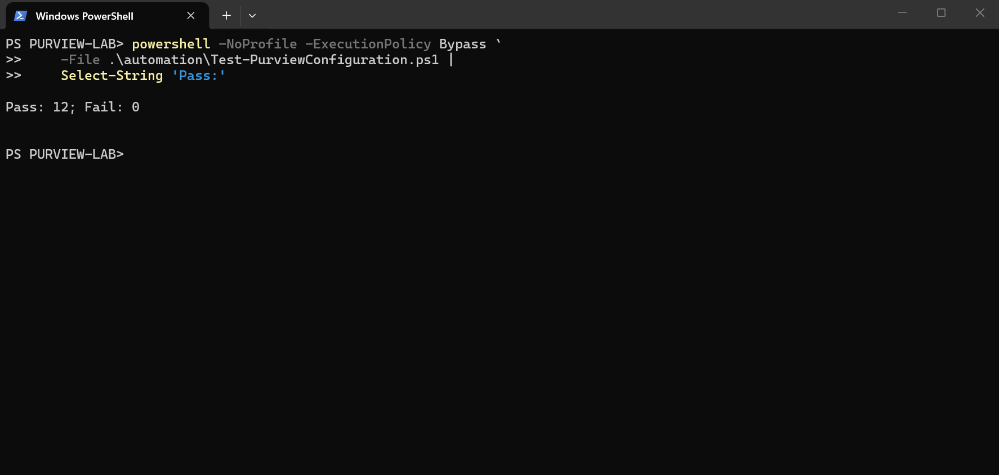
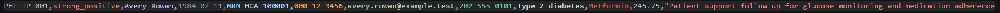
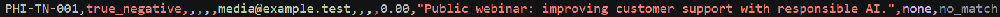

# Microsoft Purview Healthcare Data Security & AI Governance Lab

> **A recruiter-ready security portfolio:** healthcare data protection, Microsoft Purview policy design, working automation, forensic investigation, and Microsoft 365 Copilot readiness.

### Quick links

[Results](#results-i-personally-validated) · [Architecture](#how-the-solution-fits-together) · [Evidence](#local-automation-evidence) · [Security decisions](#important-project-decisions) · [Technical work](#explore-the-technical-work)

## What this project is

This is a hands-on portfolio project showing how I would help a healthcare technology company protect sensitive information in Microsoft 365 and prepare safely for Microsoft 365 Copilot.

The company and all records in this project are fictional. I used synthetic test data only.

## The business problem

A fictional company stores patient-support, employee, financial, and business information in Microsoft 365. Before introducing Copilot, it needs to answer five questions:

1. Where is sensitive information stored?
2. How should that information be labeled and protected?
3. How can inappropriate external sharing be prevented?
4. How should a possible exposure be investigated?
5. Are existing permissions safe enough for Copilot?

## What I built

- A simple classification system from Public to Highly Confidential – PHI
- A Microsoft Purview sensitivity-label design
- A healthcare DLP policy for SharePoint and OneDrive
- A test plan covering correct matches, difficult cases, false positives, and safe public data
- A fictional investigation of a possible external PHI-sharing event
- Python automation that reviews synthetic records and suggests risk levels
- PowerShell automation that checks a sanitized sample Purview configuration
- A data-retention plan
- A Copilot-readiness and AI data-governance plan
- An executive summary, remediation plan, and 30/60/90-day roadmap
- A limited NIST and ISO control mapping

## Project at a glance

| Discover | Protect | Investigate | Prepare for AI |
|---|---|---|---|
| Identify sensitive information | Apply labels and DLP rules | Determine whether exposure occurred | Review access before Copilot |
| Test true and false matches | Reduce inappropriate sharing | Preserve and evaluate evidence | Govern sensitive AI data |
| **Python analysis** | **Purview policy designs** | **Simulated forensic case** | **Copilot readiness plan** |

## Results I personally validated

| Result | Outcome |
|---|---:|
| Synthetic records analyzed | 14 |
| Python tests passed | 7 of 7 |
| PowerShell configuration checks passed | 12 of 12 |
| Failed configuration checks | 0 |

These results prove that my local code and test logic worked. They do not prove that Microsoft Purview policies were deployed in a live company environment.

## A quick example

The test data includes:

- A strong PHI example containing a fictional patient identity, medical-record number, and medical context
- A boundary case that needs human review
- A false-positive example where an MRN-like value is only a fictional marketing code
- A public-data example that should not trigger protection

This matters because a useful security system must detect real risk without blocking ordinary work unnecessarily.

| Test-case coverage | Safety validation |
|---|---|
|  |  |

## How the solution fits together

The important Copilot lesson is simple: Copilot can use information that a person already has permission to access. It does not repair overly broad permissions. That is why this project recommends owner-approved access reviews before a Copilot pilot.

## Local automation evidence

| Python analysis | PowerShell validation |
|---|---|
|  |  |

The Python tool is a demonstration detector. It is not a replacement for Microsoft Purview's classification technology.

## What was implemented and what was designed

The repository uses three visible evidence labels so a reviewer always knows what is real, designed, or fictional.

| Evidence label | Plain-English meaning |
|---|---|
| **IMPLEMENTED LOCALLY** | I personally ran and validated it on my computer |
| **DESIGNED FOR PURVIEW** | I documented how it should be configured, but did not deploy it |
| **SIMULATED INVESTIGATION** | I used a fictional event to demonstrate the investigation workflow |

### Implemented locally

- Synthetic healthcare and employee test data
- Python analysis and risk summaries
- Seven Python unit tests
- PowerShell sample export and configuration validation
- Reports, test cases, and architecture documentation

### Designed for Microsoft Purview

- Sensitivity labels and publishing approach
- PHI encryption behavior
- SharePoint and OneDrive DLP policy
- Retention and deletion approach
- Copilot-readiness controls

### Simulated

- The external PHI-sharing investigation
- Alerts, audit evidence, exposure decisions, and containment actions used in that fictional case

## Important project decisions

- Protect PHI most strongly while keeping the first rollout manageable.
- Start DLP in simulation before blocking users.
- Allow a business-justified override only after testing and tuning.
- Do not treat every technical match as a confirmed data exposure.
- Require evidence of sharing or access before confirming an incident.
- Review SharePoint and OneDrive permissions before enabling a Copilot pilot.
- Clearly separate local evidence, designs, and simulations.

## Honest limitation

I did not have an authorized Microsoft 365 tenant for this project. I therefore did not deploy Purview policies or collect real alerts and audit logs.

Instead, I personally built and tested the parts that could be completed safely on my computer, documented the Purview configurations in detail, and labeled the investigation as fictional. I do not present this project as production Purview experience.

## Explore the technical work

### Security policies

- [Classification system](policies/classification-taxonomy.md)
- [Sensitivity-label design](policies/sensitivity-label-design.md)
- [Label publishing plan](policies/label-publishing-plan.md)
- [Healthcare DLP policy](policies/dlp-policy-design.md)
- [DLP test cases](policies/dlp-test-matrix.md)
- [Data lifecycle plan](policies/data-lifecycle-plan.md)
- [AI and Copilot governance plan](policies/ai-data-governance-plan.md)

### Automation and investigation

- [Automation guide](automation/README.md)
- [Validated automation results](automation/validation-results.md)
- [Investigation playbook](investigations/investigation-playbook.md)
- [Fictional external-sharing case](investigations/external-phi-sharing-case.md)

### Business reporting

- [Executive summary](reporting/executive-summary.md)
- [Technical findings](reporting/technical-findings.md)
- [Remediation playbook](reporting/remediation-playbook.md)
- [30/60/90-day roadmap](reporting/30-60-90-day-roadmap.md)
- [NIST and ISO mapping](compliance/nist-iso-control-mapping.md)

## More visual evidence

| Strong PHI test | Boundary test |
|---|---|
|  |  |

| False-positive test | Public negative control |
|---|---|
|  |  |

These images are deliberately small record excerpts. They demonstrate test-case design—not Microsoft Purview alerts.

## My interview summary

> I already had experience with Microsoft 365, identity and access management, secure healthcare and AI-data workflows, automation, and reporting. I built this lab to connect those skills to Microsoft Purview. I personally tested the local automation, designed the Purview controls, documented a realistic investigation process, and clearly identified what would still need to be validated in an authorized Microsoft 365 tenant.

## References

- [Official Microsoft SC-401 lab instructions](https://microsoftlearning.github.io/SC-401T00-Information-Security-Administrator/)
- [Microsoft Purview documentation](https://learn.microsoft.com/en-us/purview/)
- [Microsoft Purview sensitivity labels](https://learn.microsoft.com/en-us/purview/sensitivity-labels)
- [Microsoft Purview data loss prevention](https://learn.microsoft.com/en-us/purview/dlp-learn-about-dlp)
- [Microsoft Purview DSPM for AI](https://learn.microsoft.com/en-us/purview/ai-microsoft-purview)

## Project status

All 12 project phases are complete. See [STATUS.md](STATUS.md) and [DECISION_LOG.md](DECISION_LOG.md) for the detailed record.
